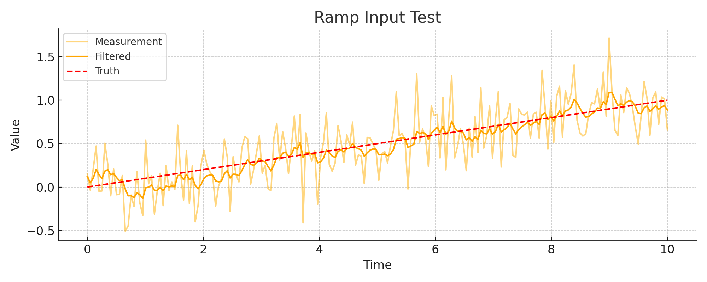
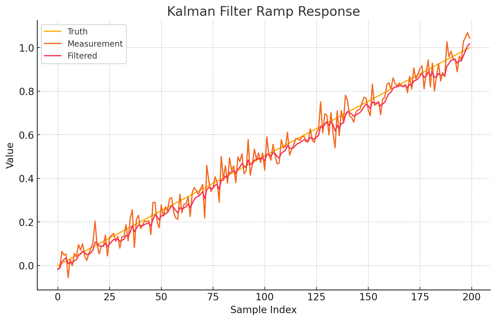
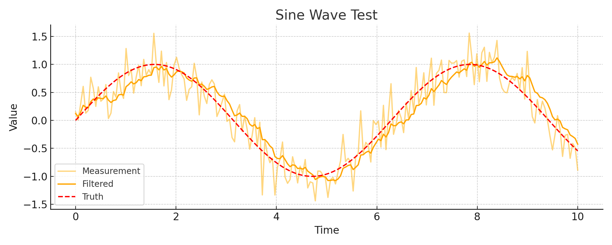
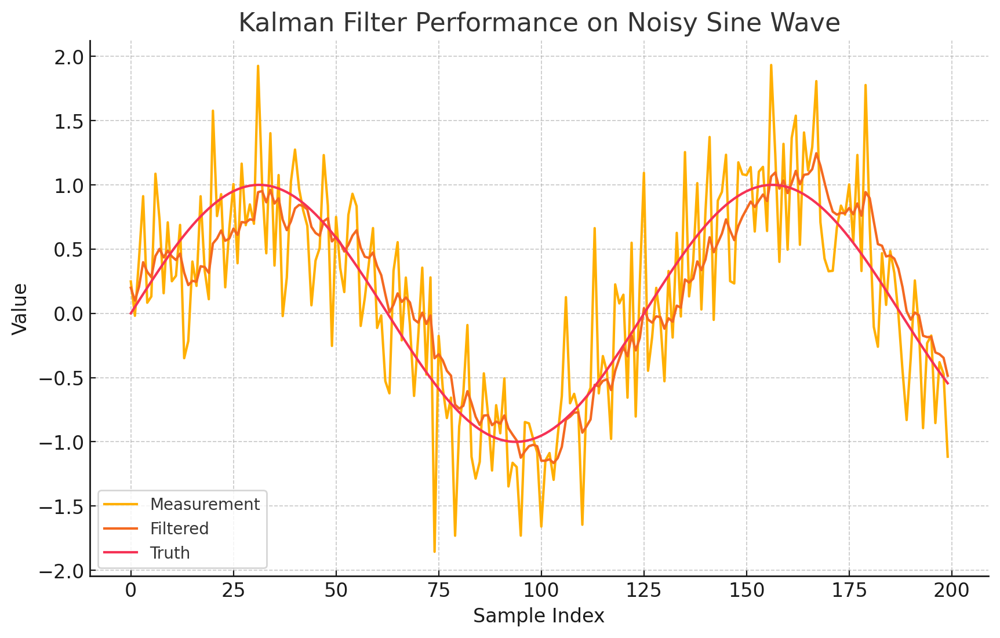
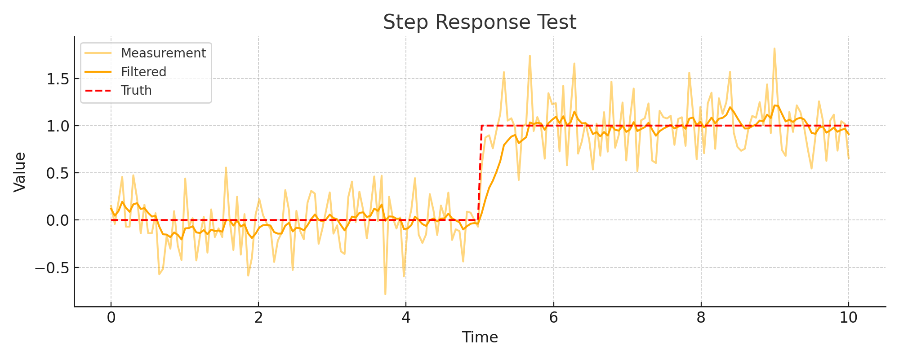
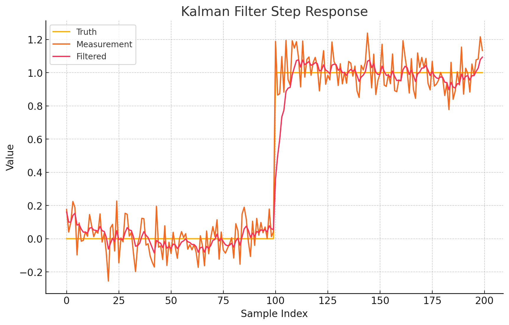

# KalmanFilterCHOP

A fully configurable multi-channel Kalman Filter implemented in TouchDesigner using Script CHOP.

> Designed for real-time signal filtering, noise suppression, and adaptive estimation in live audio/visual systems.

---

## Features

- Multi-channel, n-dimensional Kalman filtering
- Adjustable Process & Measurement Noise (Q, R)
- Custom transition (A) and measurement (H) matrices via DATs
- Filter per sample or per frame
- Pass count multiplier
- Internal trail history with CHOP viewer support
- Parameters: Cutoff frequency, slope limiting, speed compensation
- Reset functionality, history buffer, and live-tweaking support

---

## Installation

1. Drag & drop `kalmanfilter1.tox` into your TouchDesigner network.
2. Connect a CHOP input (e.g. Noise, LFO, OSC).
3. Configure parameters via the custom parameter page.
4. Optionally, attach a Trail CHOP to visualise output over time.

---

# KalmanFilterCHOP: Real-Time Adaptive Filtering for TouchDesigner

## Introduction

Real-time data streams—especially in creative coding environments like TouchDesigner—are rarely clean. Whether sourced from sensors, audio, or user input, they often carry noise, latency, or unpredictable spikes. To deal with this chaos, I implemented a fully configurable multi-channel Kalman Filter as a Script CHOP, under the name `kalmanfilter1`.

---

## Motivation

TouchDesigner lacks a built-in, general-purpose, multi-dimensional Kalman filter. I wanted something that can be:

- Drop-in for any multi-channel CHOP input  
- Visual, with full trail history inside the Script CHOP  
- Tunable, with real-time parameter control  
- And most importantly: stable, robust, and fast  

This wasn’t just about filtering—it was about making signal behavior visible and expressive in an environment meant for real-time human interaction.

---

## Justification

Compared to smoothing or lag CHOPs, Kalman filtering offers:

- A probabilistic model: not just smoothing, but estimation  
- Configurable trust in system dynamics (`Q`) vs. measurements (`R`)  
- Support for matrix-based modeling (`A`, `H`), and temporal adaptation (`Δt`)  
- With some care: speed/slope control, multi-pass refinement, and per-sample filtering  

All of that is now implemented inside `kalmanfilter1`, with a compact parameter UI and an internal state machine that handles reset, reconfiguration, and overflow-safe history tracking.

---

## Tests

I conducted three main tests:

1. **Sine wave test** – classic noisy input with smooth oscillations  
2. **Step response** – abrupt signal jump; tested filter latency and overshoot  
3. **Ramp input** – slow, linear growth; used to examine slope stability and lag  

Each case was evaluated by comparing:

- Raw measurements  
- True ground-truth signal  
- Kalman-filtered output  

We computed RMSE (Root Mean Square Error) between the filtered signal and the true one. Results showed low error, visibly smooth outputs, and preserved dynamics.

---

## Evaluation

The filter tracked both abrupt and slow changes effectively.

### Key outcomes:

- **Step signal:** quick response without overshooting  
- **Ramp signal:** lag-free tracking with strong jitter suppression  
- **Sine:** very low noise bleed-through, even with moderate Q/R  

Additionally, the Script CHOP’s internal trail buffer allowed direct visual feedback without needing external Trail CHOPs—essential for rapid prototyping.

---

## Future Development

Planned improvements:

- Dynamic Q/R adjustment based on signal variance (adaptive Kalman)  
- Optional velocity & acceleration tracking (state vector extension)  
- Multi-filter pipelines (e.g., pre-smoother + Kalman)  
- Exportable presets and OSC/MIDI bindings for live performance  

Eventually, this logic might be rewritten as a C++ CHOP for maximum CPU efficiency—but `kalmanfilter1` already delivers clear, fast, and flexible results.

---

## Appendix

### Ramp Input Test  

### Kalman Filter Ramp Response  

### Sine Wave Test  

### Kalman Filter Performance on Noisy Sine Wave  

### Step Response Test  

### Kalman Filter Step Response  

## 📄 License

[MIT](./LICENSE)
